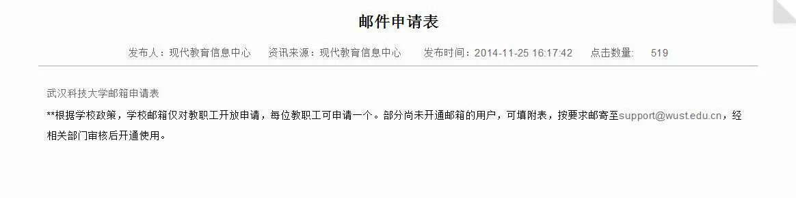

> [Apple官方说明](https://support.apple.com/zh-cn/HT205928)
 
既然 Apple 给了这个优惠政策，作为新时代大学生的我们为什么不薅这块羊毛呢？
 
中国大学生要以学生会员资格加入 Apple Music 时，需要通过UNiDAYS（一项学生验证服务）的确认。然而通过UNiDAYS的验证又需要提供个人学校电子邮件地址，即以.edu为结尾的邮箱。但是在中国地区（除了台湾）各大高校几乎不提供这种邮箱。如下图所示，我所在的学校的学校邮箱仅对教职工开放申请。

那么对于没有教育邮箱的大学生来说，这个Apple Music优惠政策似乎就是鸡肋。

别慌，要永远相信客服。

## 我是如何通过UNiDAYS的验证
最开始，我是申请到了@tp.edu.tw的台湾邮箱，然后用此邮箱申请学生会员资格。当天晚上就收到回信说这个邮箱不能验证我的学生身份，并说“If you do not have a personal institution email address please reply to this email sending us a scan or good quality photograph of your current student ID card”。很明显，Apple了解了中国大学生少有人拥有教育邮箱，于是只用提供给他们个人学生证的扫描图即可。

然后我传了两张照片过去。UNiDAYS的客服挺热情的，回信中让我提供学校网站以确认系统验证。

于是我附上了学校官方网站（注意是为.edu.cn为结尾的网址），并且贴上了学信网的学籍信息图片（以防万一）。

20分钟后就收到回信，确认了我的学生信息。登录[UNiDAYS](https://www.myunidays.com/CN/zh-CN)  

那么，学生优惠走起~

## 写在最后
不要怕麻烦，多和客服沟通，很多事情都可以想方法解决。
祝好运。
